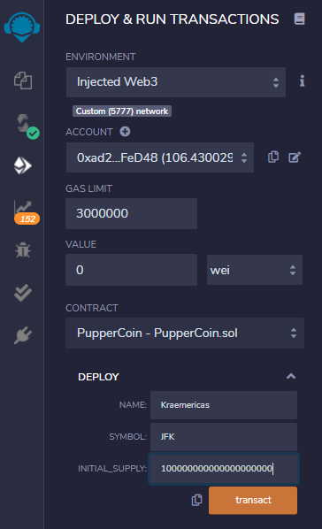

# Homework 21 - Advanced Solidity

John-Francis Kraemer

PupperCoin Contract Address: 0x718593D6D93064741910449F3aA0820EDA7ae47c

PupperCoinSaleDeployer Contract Address: 0xFBC0205250C9E18Ffc9A2b7323eF03d21618d377

Owner Address: 0xad2C39788AD5AB97b75fdeC1960014b93D7FeD48

Spender Address: 0xB812eAf68b858Dee81F70B29e6451a7f76557A3f

## PupperCoinCrowdsale.sol
The solidity smart contract for PupperCoinCrowdsale.sol is compiled.

Smart contract for PupperCoinCrowdsale.sol is deployed.

New minter is added to the contract (account #0x1ab64668166de19E0A97E077A7f959aCF96997B4)

